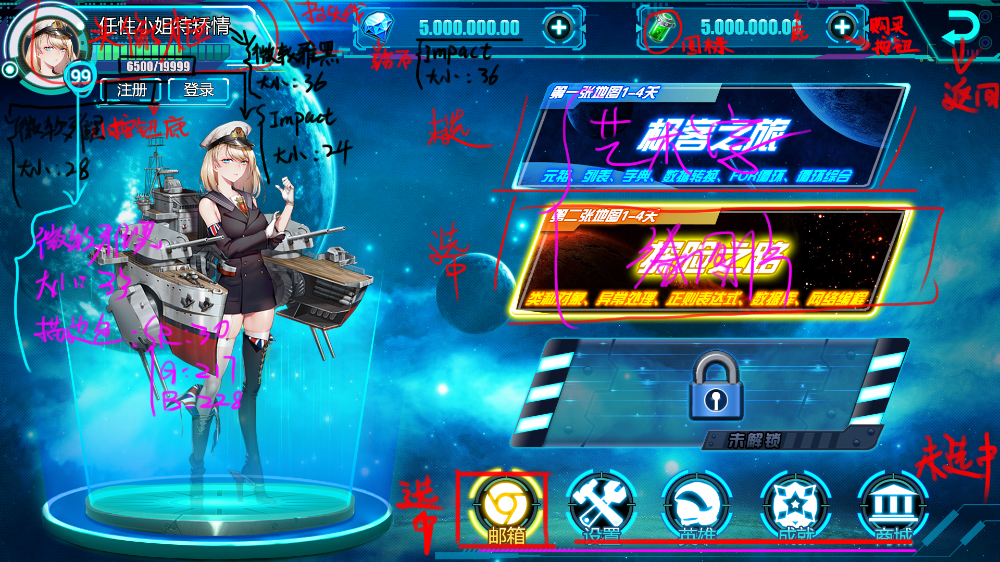



### 测试范围
    module 主界面（MAIN)：外观
### 前置条件

### 输入

### 预期输出
1. 加载主界面
2. 外观
3. 当鼠标移动到下列图标时，应有焦点效果（高亮显示等）：登录，注册，增加钻石，增加体力，探险之路，
极客之旅，竞技场，设置，英雄，成就，商城

### 测试步骤
1. 打开浏览器，导航到主界面
2. 点击／触摸“商城”图标
3. 察看界面变化是否和预期一致
