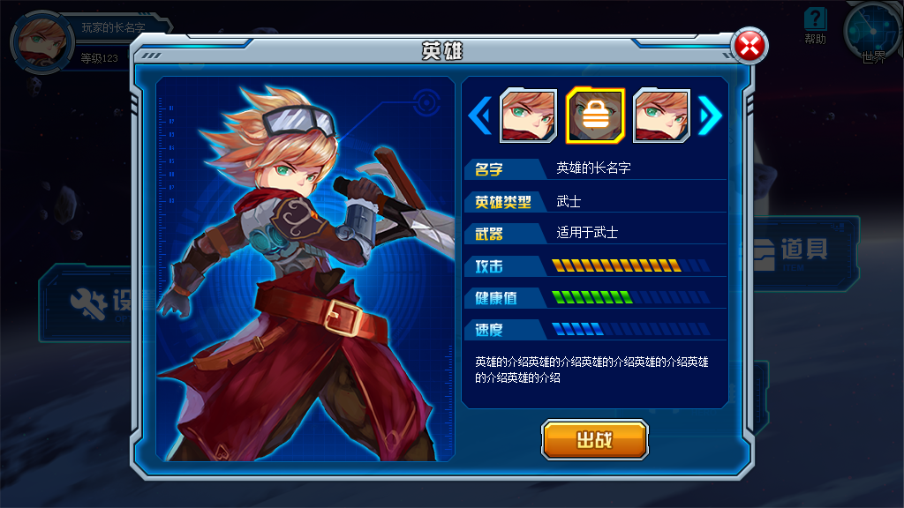



### 测试范围
  英雄模块（HERO）英雄界面

### 前置条件

### 输入
  无

### 预期输出
  1. 效果图

### 测试步骤
   1. 打开浏览器，清除缓存，cookie等
   2. 导航到主界面，点击／触摸英雄图标
   3. 查看英雄界面背景、各UI元素布局等外观和预期是否一致

### 伪代码
# module 英雄模块（HERO）

***

### 用例（it）: 可选不同角色（could choose dif roles）
1. 点击英雄头像
* 断言（expect） 出现不同人物

