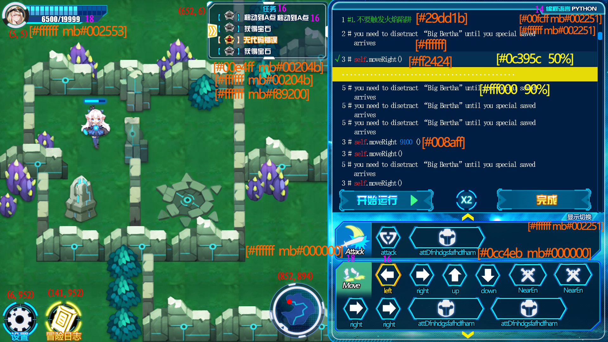



### 测试范围
    module 探险模块（ADVENTURE） 游戏界面
### 前置条件
   1. 加载编程界面
   2. 用户为匿名用户
### 输入
  无
### 预期输出
1. 用户头像为使用的英雄的头像
2. 经验值与后台数据相同
3. 等级与后台数据相同

### 测试步骤
1. 从后台获取当前用户信息数据
2. 截图当前用户信息区域，根据截图获取数据信息


# 参考
1. 美术效果图


# 伪代码
# module 探险模块（ADVENTURE）

## 用例集（describe）： 编码界面（coding page）
b4 each: 加载到编程游戏界面
### 用例（it）: 可以提示错误输入（could promt err）
输入一行错误代码
* 断言（expect）断言：出现红色叉号提示图标
### 用例（it）: 可以运行代码（could run codes）
1. 输入通关代码
2. 点击运行
* 断言（expect）断言： 小人走动
### 用例（it）: 可以做出判定（could judge）
获取判定栏内容
* 断言（expect）断言： 判定栏下拉
* 断言（expect）断言： 判定栏文本过关
### 用例（it）: 可以点击完成（could complete） 
1. if 存在“完成”按钮，点击
* 断言（expect）断言： 能够进入下一页
2. else return false（代码有误，未完成）
```
###可集成-点击事件
### 用例（it）： 可以点击继续（could continue）
1. 点击继续
* 断言（expect）断言： 回到 map-page
2. 点击下一关
* 断言（expect）断言： 进入回合页
```