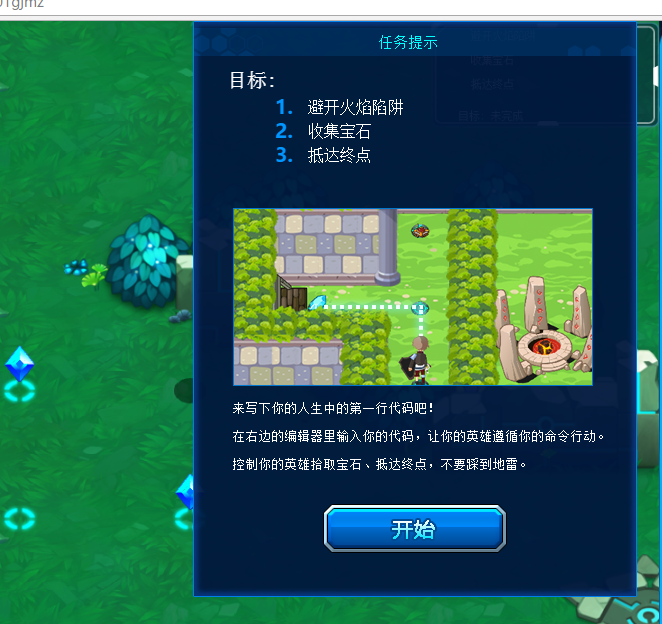



### 测试范围
 探险模块（ADVENTURE） 开始游戏

### 前置条件
  加载“开始游戏”界面
### 输入
  无
### 预期输出
  加载至正式游戏的界面
  
### 测试步骤

### 伪代码
# module 探险模块（ADVENTURE）

##(可集成-点击事件)
## 用例集（describe）：点击进入游戏（start game）
b4 each：加载 预开始游戏页面
### 用例（it）：开始并进入编程页面（start and enter game-code page）
点击开始按钮
* 断言（expect） 进入编程游戏界面