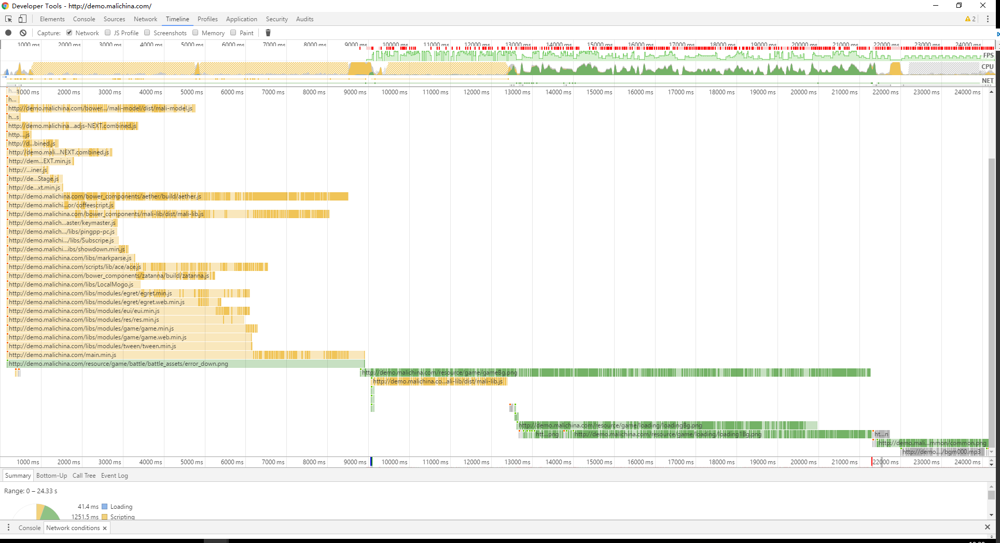
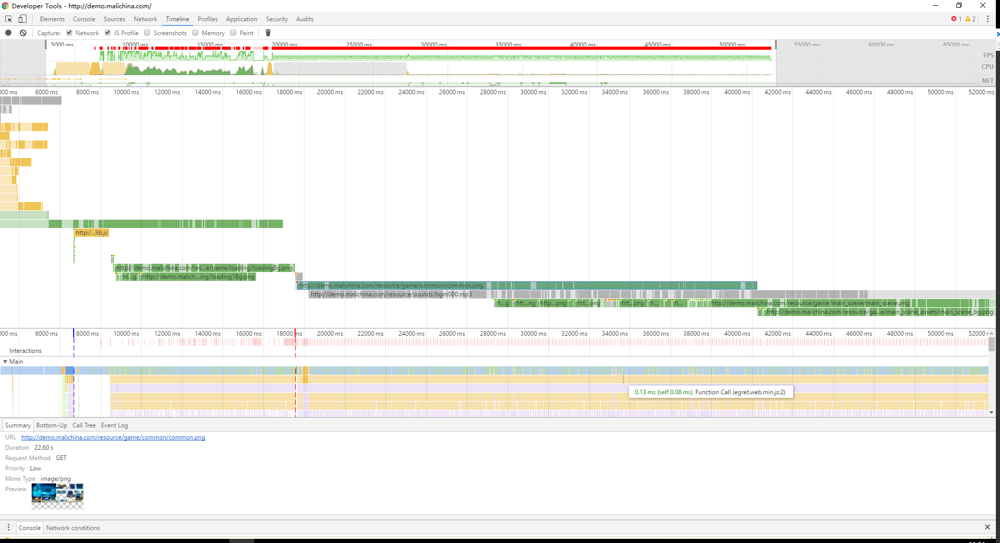

### 10.31更新 ###
  
***

## 默认网络

**mp3加载报错**  
一、耗时mp3
1. 错误描述：GET http://demo.malichina.com/resource/sounds/bgm000.mp3 net::ERR_CONTENT_LENGTH_MISMATCH
   * 下载耗时：1.7min 其他耗时：可忽略不计 大小：6.1M

二、耗时图片
1.  http://demo.malichina.com/resource/game/common/common.png
  * 下载耗时：15.32s 其他耗时：可忽略不计 大小：6.8M
2. http://demo.malichina.com/resource/game/main_scene/main_scene.png
  * 下载耗时：32.65s 其他耗时：可忽略不计 大小：6.6M
3. http://demo.malichina.com/resource/game/main_scene/main_scene_assets/main_scene_bg.png
  * 下载耗时：15.53s 其他耗时：可忽略不计 大小：2.6M

三、耗时js（请求到完成）
1.http://game.malichina.com/bower_components/aether/build/aether.js  
8.22s    下载花费：7.10s  其中解析花费时间：3.67s  大小：1.5M

2.http://game.malichina.com/bower_components/mali-lib/dist/mali-lib.js  
6.90s 其中下载时间：5.54s 大小：648k

***

## regular 4G

总耗时：1.2min

一、耗时图片
1.  http://demo.malichina.com/resource/game/common/common.png
  * 下载耗时：25.17s 其他耗时：可忽略不计 大小：6.8M
2. http://demo.malichina.com/resource/game/main_scene/main_scene.png
  * 下载耗时：24.37s 其他耗时：可忽略不计 大小：6.6M
3. http://demo.malichina.com/resource/game/main_scene/main_scene_assets/main_scene_bg.png
  * 下载耗时：10.50s 其他耗时：可忽略不计 大小：2.6M

二、耗时js（请求到完成）：
1.http://game.malichina.com/bower_components/aether/build/aether.js  
8.22s    下载花费：7.10s  其中解析花费时间：3.67s  大小：1.5M

2.http://game.malichina.com/bower_components/mali-lib/dist/mali-lib.js  
6.90s 其中下载时间：5.54s 大小：648k

## 图片参考

